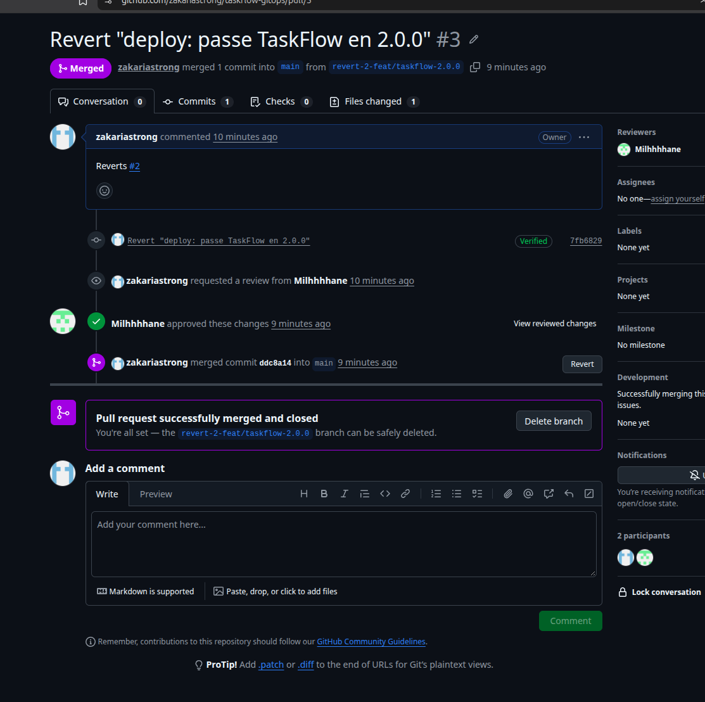
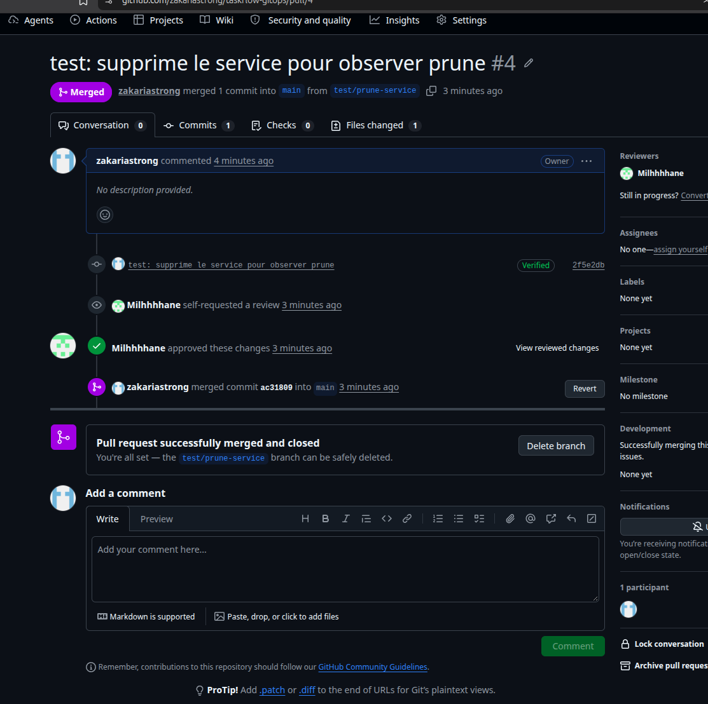

# taskflow-gitops — dépôt GitOps du cours CI/CD M2

Ce dépôt décrit **l'état voulu** de l'application TaskFlow dans Kubernetes.
Argo CD le surveille et aligne le cluster dessus : pour changer la production,
on ne tape pas de commande, on fait une **Pull Request**.

## Installation (à faire chez vous, avant le cours)

Prérequis : Docker Desktop démarré, 8 Go de RAM, 10 Go de disque libre.
Sous Windows : WSL2 (Ubuntu) + intégration WSL de Docker Desktop, et toutes les commandes dans WSL.

```bash
git clone https://github.com/9m7fjfpv9k-cyber/taskflow-gitops.git
cd taskflow-gitops
./scripts/install.sh
```

Le script crée un cluster local `kind`, installe Argo CD et Argo Rollouts,
puis télécharge les images des labs. Comptez 5 à 15 minutes.
Il peut être relancé sans risque.

## Structure

| Chemin | Rôle |
| --- | --- |
| `apps/taskflow/` | Les manifests surveillés par Argo CD |
| `argocd/application.yaml` | Déclare l'application dans Argo CD |
| `exemples/bluegreen/` | Manifests pour le déploiement Blue-Green |
| `exemples/canary/` | Manifests pour le déploiement Canary |
| `scripts/install.sh` | Installation de l'environnement |
| `scripts/argocd-ui.sh` | Ouvre l'interface d'Argo CD |
| `scripts/observe.sh` | Montre quelle version répond, et avec quel code HTTP |

## Images disponibles

`ghcr.io/9m7fjfpv9k-cyber/taskflow` en versions `1.0.0`, `1.1.0`, `2.0.0` et `2.1.0`.

## Équipe

- Zakaria (@zakariastrong)
- @Milhhhhane

## Journal des déploiements

Toute la production est changée par Pull Request. Argo CD lit le dépôt
et met le cluster à jour tout seul. Nous n'avons jamais déployé avec `kubectl`.

| Heure (merge) | Action | Version | PR | Résultat observé |
| --- | --- | --- | --- | --- |
| 10:53 | Mise en place : Argo CD pointe vers notre dépôt | 1.0.0 | #1 | 40 réponses en 1.0.0, http 200 |
| 11:41 | Déploiement de la 2.0.0 | 2.0.0 | #2 | 40 réponses en 2.0.0, http 200 |
| Entre 11:41 et 11:55 | Dérive : `kubectl scale --replicas=1` à la main | 2.0.0 | — | Argo CD remet 4 pods en 1 seconde |
| Entre 11:41 et 11:55 | Dérive : `kubectl set image` vers 1.0.0 à la main | 2.0.0 | — | Argo CD remet la 2.0.0 en 1 seconde |
| 11:55 | Retour arrière : Revert de la PR #2 | 1.0.0 | #3 | 40 réponses en 1.0.0, http 200 |
| 12:00 | Bonus : suppression de `service.yaml` | 1.0.0 | #4 | Argo CD supprime le service : 40 requêtes sans réponse (http 000) |
| 12:07 | Remise du service : Revert de la PR #4 | 1.0.0 | #5 | 40 réponses en 1.0.0, http 200 |

### Délai entre la merge et le déploiement

Pour la 2.0.0, la PR a été mergée à 11:41:08 et Argo CD a fini de déployer
à 11:41:21, soit **13 secondes**.

Ce délai change d'un déploiement à l'autre. Argo CD relit Git toutes les
60 secondes : si on merge juste après une lecture, il faut attendre la suivante.
Pour les PR #4 et #5, nous avons demandé à Argo CD de relire Git tout de suite.

La première fois, Kubernetes a aussi dû télécharger l'image 2.0.0 (16 secondes).
Les fois suivantes, l'image était déjà là et chaque pod démarrait en 6 secondes.

## Preuves

### 1. Déploiement de la 2.0.0 (PR #2)

Après la merge, Argo CD remplace les pods un par un (rolling update).
Les pods `76547969d7` sont en 1.0.0, les pods `745bdbf6f8` en 2.0.0 :

```
taskflow-745bdbf6f8-rj55d   0/1     ContainerCreating   0          0s
taskflow-76547969d7-tcg55   0/1     Completed           0          12m
taskflow-745bdbf6f8-7gp7w   1/1     Running             0          24s
```

Résultat :

```
$ ./scripts/observe.sh
     40 version=2.0.0 http=200
```

### 2. Dérive annulée par Argo CD

Nous avons modifié le cluster à la main :

```
$ kubectl -n taskflow scale deployment taskflow --replicas=1
$ kubectl -n taskflow set image deployment/taskflow taskflow=ghcr.io/9m7fjfpv9k-cyber/taskflow:1.0.0
```

Argo CD a tout remis comme dans Git, en environ 1 seconde. Les pods 1.0.0
ont été arrêtés avant même d'être prêts :

```
Scaled down replica set taskflow-76547969d7 from 2 to 0
Scaled up replica set taskflow-745bdbf6f8 from 3 to 4

$ ./scripts/observe.sh
     40 version=2.0.0 http=200
```

### 3. Retour arrière par PR (PR #3)

Avec le bouton « Revert » de GitHub. La PR est relue et approuvée comme
n'importe quel changement :



```
$ ./scripts/observe.sh
     40 version=1.0.0 http=200
```

### 4. Bonus : prune (PR #4)

Nous avons supprimé `service.yaml` dans Git. Argo CD a supprimé le service
dans le cluster, et l'application n'était plus joignable :



```
$ kubectl -n taskflow get service
No resources found in taskflow namespace.

$ ./scripts/observe.sh
     40 version=aucune http=000
```

Nous avons ensuite remis le service avec un revert (PR #5) :

```
$ ./scripts/observe.sh
     40 version=1.0.0 http=200
```

## Questions du lab

### Push ou pull ?

**Pull.** Personne ne se connecte au cluster pour déployer. Argo CD est installé
**dans** le cluster : il va lire le dépôt Git et applique lui-même les changements.
Ni les développeurs ni un pipeline n'ont besoin des clés du cluster.

### Qui a corrigé quoi ?

Nous avons modifié le cluster à la main deux fois : passer à 1 pod, puis
remettre la version 1.0.0. **Argo CD a annulé ces deux changements tout seul**,
en environ 1 seconde, car l'option `selfHeal` est activée. Il a remis ce que dit
Git : 4 pods en version 2.0.0. Une modification faite à la main ne dure pas
et ne laisse aucune trace dans Git.

De la même façon, quand nous avons supprimé `service.yaml` dans Git, Argo CD
a supprimé le service dans le cluster, car l'option `prune` est activée.

### Pourquoi git revert ?

Parce que Git est la seule source de vérité. Si on revient en arrière
directement sur le cluster, Argo CD annule ce retour, comme pour les dérives.
Avec un `git revert`, le retour en arrière passe par une PR :

- **il est tracé** : on sait qui l'a fait, quand et pourquoi ;
- **il est relu** : l'autre membre de l'équipe doit l'approuver ;
- **il est réversible** : on peut annuler le revert si besoin.
